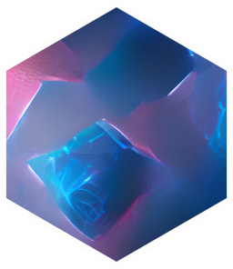

<!-- PROJECT LOGO -->
 

  

  <h3 align="center">SCION</h3>

  

    Sodium Channel functional variant prediction
     
    <a href="https://cbosselmann.shinyapps.io/SCION/"><strong>Access SCION »</strong></a>
     
    
     
  

<!-- ABOUT THE PROJECT -->
## About The Project
  

Variants in genes encoding voltage-gated ion channels are associated with a wide spectrum of neurological diseases. Missense variants lead to amino acid substitutions, which in turn affect mutant channel biophysical function, leading to an overall gain- or loss-of-function at subunit and channel level. This has implications for diagnosis, treatment and prognosis. Currently, the standard method of evaluation is electrophysiology. Here, we introduce a machine learning model trained on variants with known functional effects and phenotypes [1]. The model builds on our previous MTL-SVM framework [2] and extends it towards phenotypic similarity learning in a localized (MT)MKL model. Further information is available in the manuscript (PREPRINT PENDING) and AIMe Registry Report (aime.report/xmSKHj).

  
<!-- USAGE EXAMPLES -->
## Usage and Limitations

The model strictly predicts the overall net biophysical effect of a missense variant (amino acid substitution) at subunit level. Complex or mixed functional effects (i.e. gain- and loss-of-function, loss of ion selectivity, leak currents) are currently beyond model capabilities. Electrophysiology remains the gold standard method for variant evaluation. The model does not include information on modulators (e.g. FGF12), experimental metadata, or beta-subunits. Results may be subject to additional effects at neuronal, network, or phenotype level. Due to limited availability of curated data sets, training data does not include all known (i.e. functionally studied) variants. A literature search and expert review should be performed, and the model must never be used as the sole data source for variant interpretation. For optimal performance, user input of phenotypic terms (human phenotype ontology, HPO, or mappable databases including OMIM or ORPHA) is expected. If no phenotype is provided, a sequence- and structure-based MTL-SVM is used.

<!-- CONTRIBUTING -->
## Contributions and Contact

Any contributions are **greatly appreciated**. If you have a suggestion that would make this better, please fork the repo and create a pull request. You can also simply open an issue. Feel free to reach out with any suggestions:

Christian Bosselmann 
Department of Neurology and Epileptology, Hertie Institute for Clinical Brain Research, University Hospital Tuebingen 
Methods in Medical Informatics, Department of Computer Science, University of Tuebingen 
Hoppe-Seyler-Str. 3 
72076 Tuebingen 
Email: christian.bosselmann@med.uni-tuebingen.de 
Tel: 0049 70701290 
Twitter: @cmbosselmann 

<!-- SYS REQ -->
## System requirements

R 4.2.1
Tested on macOS Monterey 12.6 (21G115) 
All R dependencies included 
No non-standard hardware required 

<!-- INSTALL -->
## Installation guide

Download and unzip repository. Open experiments.R for a demo script that reproduces the manuscript results. Install time depends on download speed. Expected run time depends on hardware and model parameters. For some model parameters, model run time may exceed 12 hrs.

<!-- LICENSE -->
## License

Distributed under the MIT License. See `LICENSE.txt` for more information.

<!-- REFERENCES -->
## References

<a id="1">[1]</a>
Brunklaus, A., Feng, T., Brünger, T., Perez-Palma, E., Heyne, H., Matthews, E., Semsarian, C., Symonds, J. D., Zuberi, S. M., Lal, D., & Schorge, S. (2022). Gene variant effects across sodium channelopathies predict function and guide precision therapy. In Brain. Oxford University Press (OUP). https://doi.org/10.1093/brain/awac006

<a id="2">[2]</a>
Boßelmann, C. M., Hedrich, U. B. S., Müller, P., Sonnenberg, L., Parthasarathy, S., Helbig, I., Lerche, H., & Pfeifer, N. (2022). Predicting the functional effects of voltage-gated potassium channel missense variants with multi-task learning. In eBioMedicine (Vol. 81, p. 104115). Elsevier BV. https://doi.org/10.1016/j.ebiom.2022.104115
